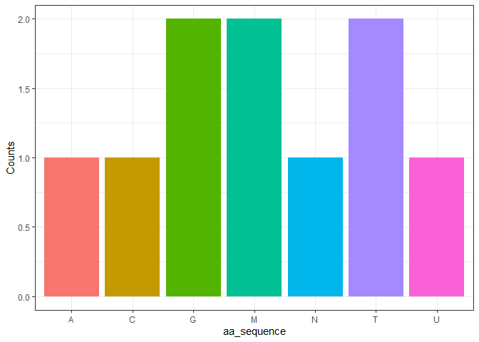
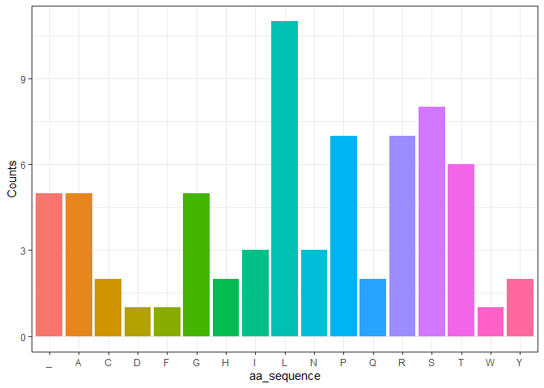

CDMOLBIO_gr20
================

<!-- README.md is generated from README.Rmd. Please edit that file -->

This package replicates the central dogma of molecular biology,
translating DNA into an amino acid sequence and visualizes the
distribtuion of amino acid residues in the protein resulting from an AA
sequence.

From GitHub repo
`https://github.com/rforbiodatascience25/group_20_package`

## Examples

``` r
library("CDMOLBIO")
set.seed("2025")
```

### Generate random sequence with `generate_dna`

``` r
generate_dna(36)
#> [1] "ACCTAGTGTAACCGGGAGGGGTACGAACATCGTCGT"
```

### Translate with `transcribe_dna_to_rna`

``` r
transcribe_dna_to_rna("ATGCTGTGC")
#> [1] "AUGCUGUGC"
```

### Extract codons to list from string with `get_codons`

``` r
get_codons("AUGCUGUGCAUGCUGAUG")
#> [1] "AUG" "CUG" "UGC" "AUG" "CUG" "AUG"
```

### Take list of codons and return string of amino acids with `translation`

``` r
translation(c("AUG", "UUU", "UUC"))
#> [1] "MFF"
```

### Plot amino acid distribution with `aa_bar_plot`

``` r
aa_bar_plot("MTGCTGAUMN")
```



### Using everything together

``` r
generate_dna(216) |>
  transcribe_dna_to_rna() |>
  get_codons(start = 2) |>
  translation() |>
  aa_bar_plot()
```



## Use case

This package can be used to generate a random DNA sequence and follow
the central dogma of molecular biology to see the resulting protein
sequence. Furthermore it can visualize the composition of amino acids in
the resulting protein.

## Limitations & considerations for new features

Currently the package only supports generating random sequences. A
feature to load sequences from FASTA or other formats could be added,
though other packages are likely to already provide this functionality.
The generated DNA can sometimes result in a codon not encoding a protein
(as can be seen in the `_` category on the plot above. In the future a
proofreading check could easily be implemented or alternatively entire
codons could be chosen instead of single nucleotide. Furthermore the
distribution of amino acid is currently only dependent on the number of
codons encoding a specific amino acid. In the future sequences could be
adjusted so the distribution was either equal or even specified or set
from natural occurrence.
